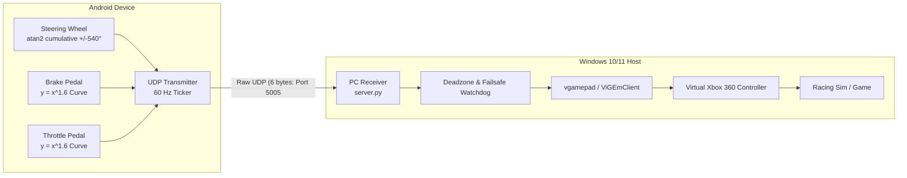

# Virtual Driving Controller

A high-performance, low-latency, cross-platform Virtual Driving Controller system for racing simulations (e.g., *Forza Horizon*, *Euro Truck Simulator 2*, *Assetto Corsa*, *F1*). Replaces binary keyboard steering with an Android touchscreen analog controller delivering multi-rotation wheel steering and progressive throttle/brake pedals over a 60 Hz UDP connection.

---

## System Architecture



---

## Packet Protocol & Binary Serialization

To achieve minimal latency and avoid garbage collection or JSON parsing overhead, the client streams binary datagrams formatted as little-endian `<hHH` (exact total of **6 bytes**):

| Byte Offset | Type | Name | Range | Virtual Controller Mapping |
|:---:|:---:|:---:|:---:|:---|
| `0x00` | `int16` | `steer` | `-32768` to `32767` | Xbox 360 Left Stick X Axis |
| `0x02` | `uint16` | `throttle` | `0` to `65535` | Xbox 360 Right Trigger (scaled `0..255`) |
| `0x04` | `uint16` | `brake` | `0` to `65535` | Xbox 360 Left Trigger (scaled `0..255`) |

- **Frequency**: 60 Hz (~16.6 ms ticker).
- **Watchdog Failsafe**: If no datagrams arrive for > 500 ms, the PC receiver automatically resets steering and pedals to neutral to avoid runaway acceleration.

---

## Prerequisites & Installation

### 1. Windows PC Prerequisites

1. **Python 3.10+** (ensure `Add python.exe to PATH` is checked).
2. **ViGEmBus Driver (Bundled in this package!)**:
   - Simply double-click **`install_driver.bat`** (or run `drivers/ViGEmBus_Setup.exe`).
   - No external downloads required!
3. **Install Python dependencies**:
   ```bash
   cd server
   python -m pip install -r requirements.txt
   ```
   *(Or just double-click `run_server.bat` which auto-installs everything for you).*

### 2. Android Client Setup

1. Enable **Developer Options** and **USB Debugging** on your Android device.
2. Build and install the Flutter client:
   ```bash
   cd client
   flutter run --release
   ```
   *(Or build an APK with `flutter build apk --release` and copy it to your phone).*

---

## Quick Start & Running

### Starting the PC Receiver

Double click [run_server.bat](file:///c:/Users/kbven/OneDrive/Documents/controllor/run_server.bat) or run from terminal:
```bash
python server/server.py
```

Options:
- `--host 0.0.0.0`: Bind address (default listens on all network interfaces).
- `--port 5005`: UDP listening port (default: 5005).
- `--deadzone 600`: Center steering deadzone (default: ~1.8% of 32767).
- `--no-gamepad`: Run in inspection/telemetry mode without creating a virtual controller (useful for testing).

The console features a live real-time HUD showing incoming Hz, client IP, and visual axis indicators:
```
[ACTIVE] Client: 192.168.1.45:51280    Hz:  60.0 | Steer: [     <<<<<|          ]  -54.2% | Thr: [=======   ]  72.0% | Brk: [          ]   0.0%
```

---

## Connection Modes

### Mode A: Wi-Fi (Local Network)
1. Ensure both your PC and phone are connected to the same Wi-Fi network.
2. On your PC, find your local IP address by running `ipconfig` in Command Prompt (look for *IPv4 Address*, e.g., `192.168.1.100`).
3. In the mobile app, tap the top-right connection badge and enter your PC's IP address.
4. If packets do not arrive, ensure UDP port 5005 is allowed in Windows Defender Firewall:
   ```powershell
   New-NetFirewallRule -DisplayName "Virtual Driving Controller" -Direction Inbound -LocalPort 5005 -Protocol UDP -Action Allow
   ```

### Mode B: Tethered USB Mode (Sub-1ms Latency, Bypasses Wi-Fi Jitter)
When competing in high-stakes sim racing, Wi-Fi jitter can introduce 2–15 ms packet variance. Using ADB over a USB cable provides deterministic `< 1 ms` latency:

1. Connect your Android phone to the PC via USB.
2. Run the included script [usb_connect.bat](file:///c:/Users/kbven/OneDrive/Documents/controllor/usb_connect.bat) (or run `adb reverse tcp:5005 tcp:5005`).
3. In the mobile app, tap the **USB** toggle in the top bar (automatically targets `127.0.0.1:5005`).

---

## Controls & Input Physics

### Left Screen: Rotational Steering Wheel
- **Angular Tracking**: Calculated via $\Delta\theta = \text{atan2}(dy, dx)$ with cumulative tracking up to $\pm 540^\circ$ (1.5 full turns lock-to-lock).
- **Spring-back Physics**: When released, a damped spring animation smoothly returns the wheel to $0^\circ$ neutral.
- **Center Marker**: Prominent top yellow/cyan racing stripe for rapid alignment verification.
- **Adjustable Lock**: Switch between $\pm 360^\circ$, $\pm 540^\circ$, or $\pm 900^\circ$ inside the in-app settings modal.

### Right Screen: Dual Progressive Pedals
- **Analog Brake (Left Strip)** & **Analog Throttle (Right Strip)**.
- **Exponential Response ($y = x^{1.6}$)**:
  - 20% touch travel $\rightarrow$ 7.6% throttle (precision low-speed pit and traction control).
  - 50% touch travel $\rightarrow$ 33% throttle.
  - 100% touch travel $\rightarrow$ 100% throttle.
- **Auto-Release Spring**: Auto-snaps back to 0.0 upon finger release.

---

## Verification & Testing

### 1. Server Unit & Protocol Tests
```bash
python server/test_server.py
```

### 2. Synthetic 60 Hz Mock Transmission
Run the included mock client to test server reception without an Android device:
```bash
python server/mock_client.py --duration 5.0
```

### 3. Flutter Client Tests & Lints
```bash
cd client
flutter test
flutter analyze
```

### 4. Windows Game Controller Calibration
Press `Win + R`, type `joy.cpl`, and hit Enter. Select the **Xbox 360 Controller for Windows** and click **Properties** to see live steering axis and trigger responses.
